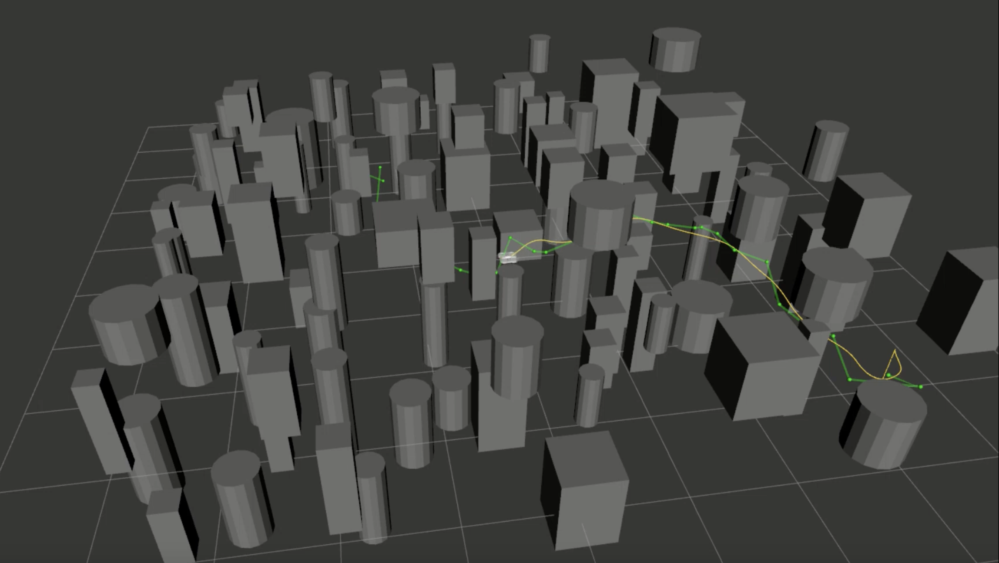

# PDM Project

Welcome to the PDM Project Group 38

*Contributors: Chiel de Dood (4915607), Alexandre Ferreira (6282598), Martijn Habers (5064767), and Jason Kim (6163246)*

<!-- embed youtube video -->
[](https://www.youtube.com/embed/YocB6JYRgxA?si=X_jh2rqlZUxvwJ2J)

## Table of Contents

- [Overview](#overview)
- [Packages](#packages)
  - [prm_navigation](#prm_navigation)
  - [sjtu_drone_bringup](#sjtu_drone_bringup)
  - [sjtu_drone_control](#sjtu_drone_control)
  - [sjtu_drone_description](#sjtu_drone_description)
  - [world_creator](#world_creator)
  - [filled_world.world](#filled_worldworld)

## Overview

This Project is structured to provide a framework for simulating and controlling drones within a 3D environment. It includes modules for path planning using Probabilistic Roadmaps (PRM), drone control logic, environment description, and world creation.

## Packages

### prm_navigation

This package is responsible for path planning using the Probabilistic Roadmap (PRM) algorithm with Dijkstra path finding. It takes an occupancy map as input and computes an optimal path for the drone to navigate through the environment.

### sjtu_drone_bringup

This package contains the necessary configurations and launch files to initialize the drone model within the Gazebo simulation environment. It sets up the simulation parameters and ensures the drone is ready for operation.

### sjtu_drone_control

This package implements the control algorithms required for drone operation. It manages the drone's flight dynamics for stable and responsive control during simulation.

### sjtu_drone_description

This package provides the Unified Robot Description Format (URDF) files that define the drone's physical and visual properties. It also includes the world description, detailing the simulated environment in which the drone operates.

### world_creator

This package is designed to convert 3D world models into occupancy maps. These maps are essential for path planning algorithms like PRM, as they represent the navigable and obstructed areas within the environment.

### filled_world.world

This is the 3D world environment file used in the simulation. It defines the layout, obstacles, and other elements present in the simulated environment for a realistic scenario for drone operation.

## Pre-requisites

You must have the following installed on your system to run the simulation:
- ROS Humble
- Gazebo
- Python 3.8 or higher

## Usage

To run the simulation, follow these steps:

1. Clone the repository to your local machine:

```
git clone git@github.com:martijnhabers/PDM-project.git
```

2. Build the workspace:

```
cd PDM-project
colcon build
source install/setup.bash
```

3. Prepare the environment:

Before running the simulation you must first generate the world's environment for gazebo. To do this, run the following command:

```
ros2 run world_creator creator
```

Next, generate an occupancy map from the world file:

```
python3 src/world_creator/test/WorldListExport.py
```

Next, generate the PRM path planning graph (offline):

```
python3 src/prm_navigation/prm_navigation/prm.py
```

4. Launch the simulation:

First launch RViz:

```
rviz2 -d src/prm_navigation/prm_navigation/prm.rviz
```

Running the following command starts the prm_navigation node, and the visualization node which converts types for visualization in RViz:

```
ros2 launch prm_navigation prm.launch.py
```

Run the following command to start the drone simulation:

```
ros2 launch sjtu_drone_control drone_control_launch.py
```

5. Control the drone:

Now you must give the drone a goal in 3D space to navigate to based on its current position. You can do this by publishing a Pose message to the 'goal_position' topic. For example:

```
ros2 topic pub -1 /goal_position geometry_msgs/msg/Pose "{position: {x: 0.0, y: 0.0, z: 0.0}}" 
```